I'll create a README.md for the IAM security project using first person pronouns, similar to the AWS account creation project.

# My AWS Identity and Access Management (IAM) Project for Zappy e-Bank

## Overview
I'll guide you through implementing AWS Identity and Access Management (IAM) for a hypothetical fintech startup called Zappy e-Bank. I'll demonstrate how to create and manage secure access to AWS resources using IAM users, groups, policies, and Multi-Factor Authentication (MFA).

## Introduction to Cloud Computing Security

As I've learned, cloud computing delivers services over the internet, including servers, storage, databases, networking, software, analytics, and intelligence. This project focuses specifically on the security aspects of cloud computing through IAM implementation.

### What is IAM?
In my understanding, IAM (Identity and Access Management) serves as the security gatekeeper for AWS resources:
- It helps me control who is authenticated (signed in)
- It determines who is authorized (has permissions) to use resources
- It allows me to implement the principle of least privilege

### Why IAM Matters for Zappy e-Bank
For a fintech company like Zappy e-Bank, I recognize that security and compliance are paramount. The company must:
- Securely manage sensitive customer financial data
- Strictly control access to cloud resources
- Maintain regulatory compliance
- Scale security controls as the company grows

## Project Goals and Learning Outcomes
By completing this project, I will:
1. Set up IAM users and groups for different roles at Zappy e-Bank
2. Create and apply custom IAM policies based on job functions
3. Test access controls to validate security configurations
4. Implement Multi-Factor Authentication (MFA) for enhanced security

## My Step-by-Step Implementation Process

### 1. Project Setup
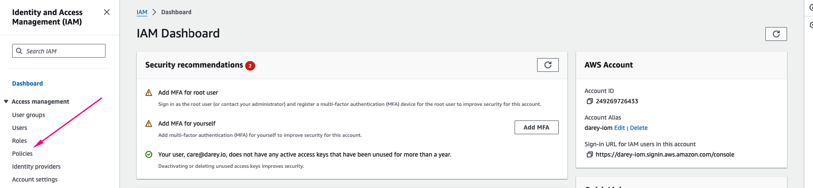
1. I logged into the AWS Management Console using my administrator account
2. I navigated to the IAM Dashboard to manage users, groups, roles, and policies

### 2. Creating Policies for Different Teams

#### Developer Policy Creation
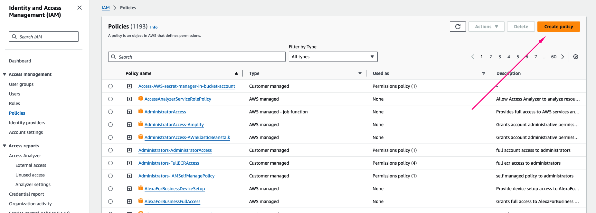
1. I clicked on "Policies" in the IAM console
2. I selected "Create policy"
3. In the service selection, I searched for EC2
   
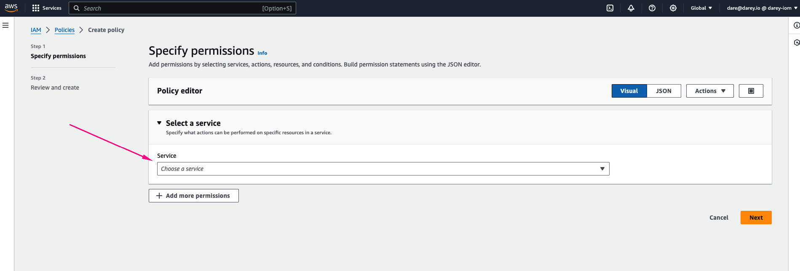

1. I selected "All EC2 actions" checkbox
2. I selected "All" in the Resources section
3. I clicked Next and named it "developers"
4. I added a description explaining the policy purpose
5. I clicked "Create Policy"

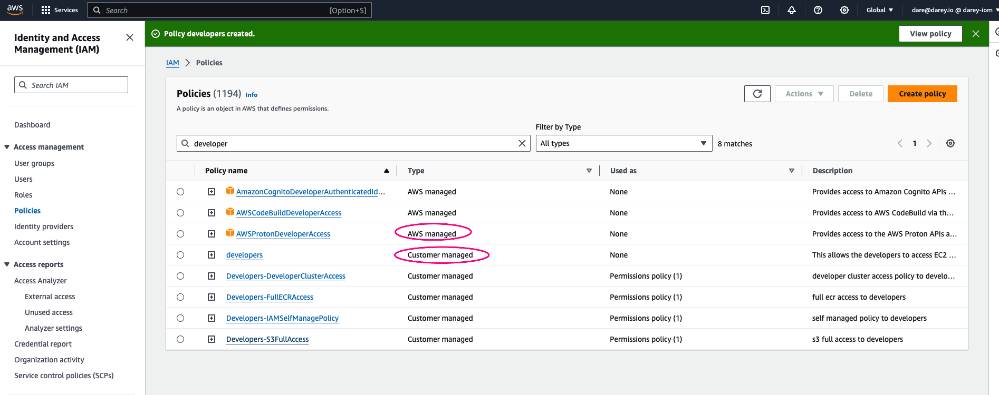
- I observed both AWS managed policies and my newly created customer managed policy

#### Data Analyst Policy Creation
1. I repeated the process for data analysts
2. Instead of EC2, I searched for S3
3. I selected "All S3 actions" checkbox
4. I selected "All" in the Resources section
5. I named the policy "analyst"
6. I clicked "Create Policy"

### 3. Creating Groups for Different Teams

#### Development Team Group
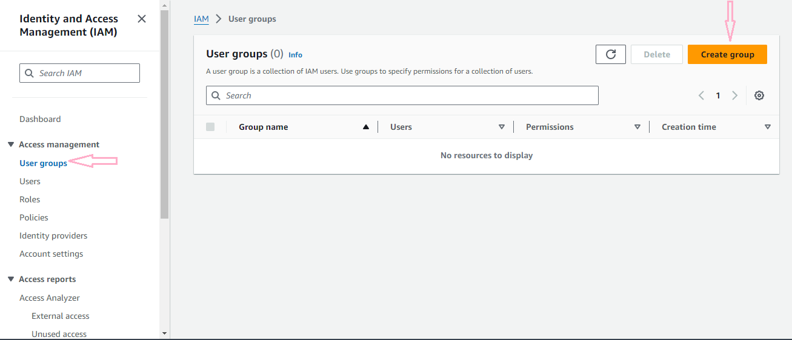
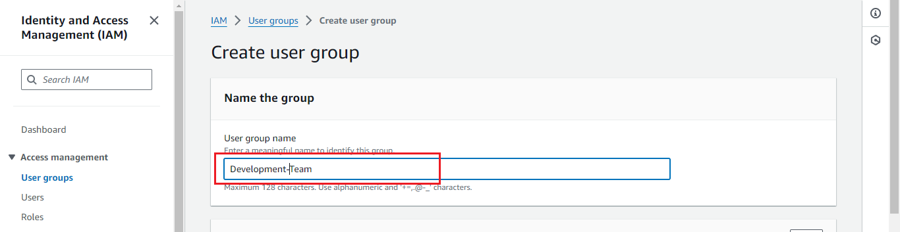
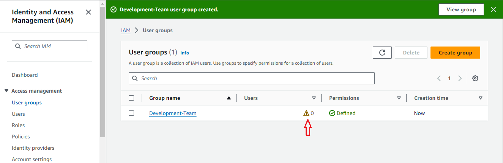

1. I navigated to "User groups" in the IAM console
2. I clicked "Create group"
3. I named the group "Development-Team"
4. I attached the "developers" policy I created earlier
5. I clicked "Create group"

#### Data Analyst Team Group
I repeted the same process for the data analyst team:

### 4. Creating IAM Users

#### Creating John's User Account
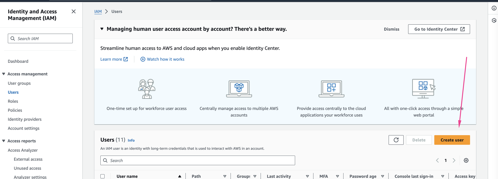
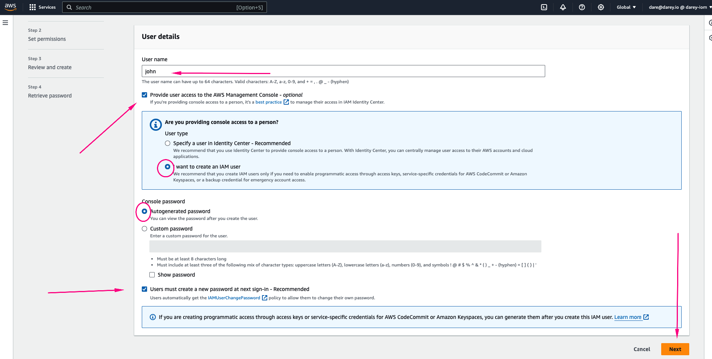

1. I navigated to "Users" in the IAM console
2. I clicked "Create user"
3. I entered "John" as the username
4. I enabled AWS Management Console access
5. I selected "Add user to group"
6. I added John to the "Development-Team" group
7. I reviewed the details and clicked "Create user"

#### Creating Mary's User Account
1. I repeated the process for Mary
2. I entered "Mary" as the username
3. I enabled AWS Management Console access
4. I selected "Add user to group"
5. I added Mary to the "Analyst-Team" group
6. I reviewed the details and clicked "Create user"

### 5. Testing and Validation

#### Testing John's Access
1. I logged in as John using his credentials
2. I navigated to the EC2 dashboard
3. I confirmed John could view and manage EC2 instances
4. I verified John couldn't access unauthorized AWS services

#### Testing Mary's Access
1. I logged in as Mary using her credentials
2. I navigated to the S3 dashboard
3. I confirmed Mary could view and manage S3 buckets
4. I verified Mary couldn't access unauthorized AWS services

### 6. Implementing Multi-Factor Authentication (MFA)

#### Setting Up MFA for John
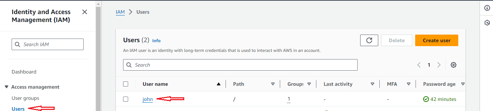
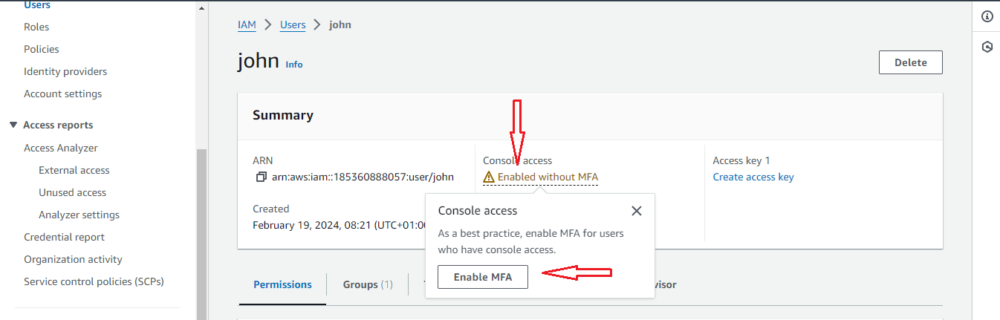
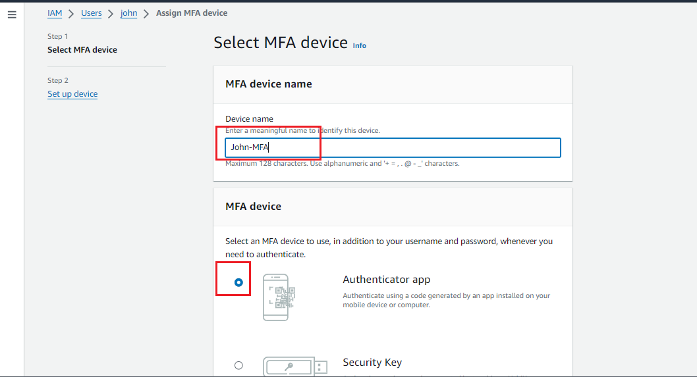
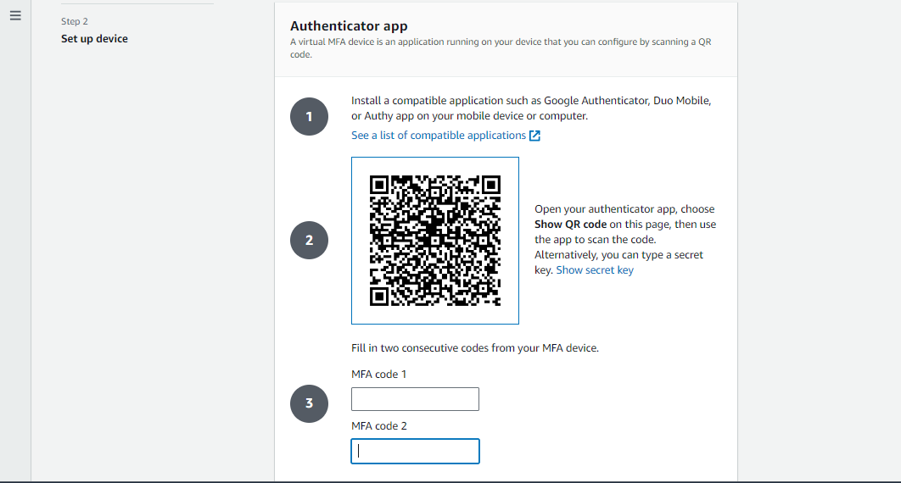
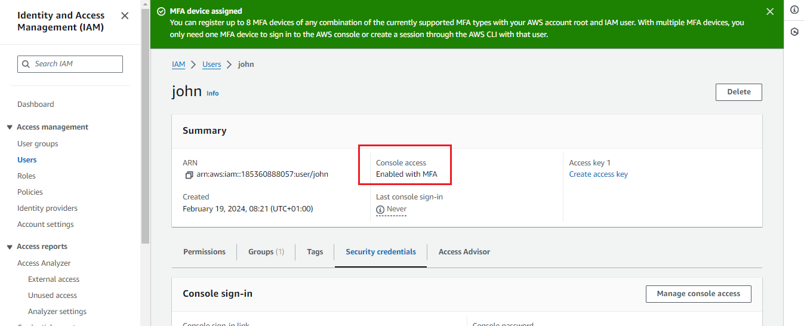
1. I logged in as John
2. I navigated to "My Security Credentials"
3. I clicked on "Assign MFA device"
4. I selected "Virtual MFA device"
5. I used Google Authenticator on my mobile device to scan the QR code
6. I entered two consecutive MFA codes to
7.  confirm setup
8. I clicked "Assign MFA"

#### Setting Up MFA for Mary
1. I repeated the MFA setup process for Mary
2. I confirmed her MFA device was properly configured

## Project Reflection

### The Role of IAM in AWS
Through this project, I've learned that IAM serves as the foundation of security in AWS. It allows me to control access to AWS services and resources securely. I now understand how IAM provides the tools to implement authentication and authorization, ensuring only the right people have access to the right resources.

### Differences Between IAM Users and Groups
I've learned to distinguish between:
- **IAM Users**: Individual identities I create for specific people or services
- **IAM Groups**: Collections of IAM users that I can manage collectively

For Zappy e-Bank, I created individual users (John and Mary) for accountability and tracking, while using groups (Development-Team and Analyst-Team) for efficient permission management as the company grows.

### Process of Creating IAM Policies
I found that creating custom IAM policies involves:
1. Identifying the specific AWS services the role needs access to
2. Determining the level of access required (read, write, full access)
3. Defining the resources these permissions apply to
4. Creating and naming the policy document
5. Attaching the policy to appropriate users or groups

### The Principle of Least Privilege
I've implemented the principle of least privilege by:
- Giving John access only to EC2 resources as needed for his backend development role
- Restricting Mary's access to only S3 resources required for her data analysis work
- Using groups to maintain consistent permissions across similar roles

This approach minimizes security risks by ensuring team members have only the permissions necessary to perform their job functions.

### Scenario Implementation for John and Mary
For John (backend developer):
- I created an IAM user account
- I added him to the Development-Team group
- I attached the developers policy granting EC2 access
- I set up MFA for additional security

For Mary (data analyst):
- I created an IAM user account
- I added her to the Analyst-Team group
- I attached the analyst policy granting S3 access
- I set up MFA for additional security

This configuration ensures both team members can perform their jobs efficiently while maintaining appropriate security boundaries.

## Additional Security Considerations
As I continue to learn about AWS security, I'll explore:
- Password policies for IAM users
- IAM roles for temporary access
- AWS Organizations for managing multiple accounts
- IAM Access Analyzer for policy validation
